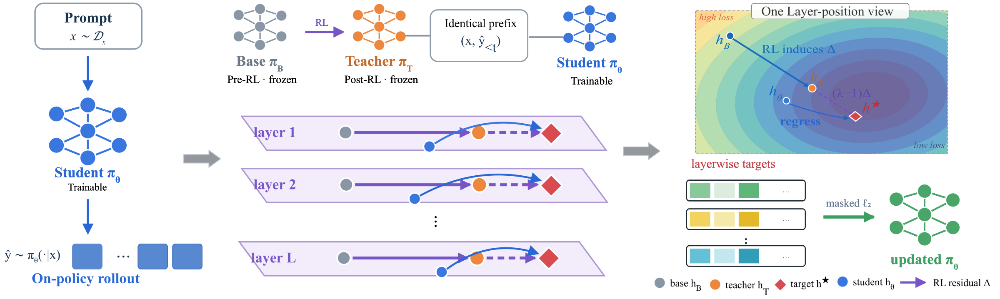

# RIDE

**The Teacher Is a Direction, Not a Destination: Extrapolating RL-Induced Representation Residuals in On-Policy Distillation**

## Abstract

On-policy distillation (OPD) trains a student to match the teacher's next-token distributions on the student's own trajectories and has yielded substantial empirical gains. Generalized variants allow the student to surpass the teacher by extrapolating an implicit reward in output space. The language-model head, however, attenuates this change anisotropically: much of the change encoded in the teacher's hidden states reaches the logits at a small fraction of its weight, and the sampled-token log-probability ratios on which output-space extrapolation relies inject noise that the extrapolation amplifies, making training unstable. We observe that reinforcement learning (RL) shifts a model's internal representations relative to its base checkpoint, and that the direction of this shift can be measured at every layer. Motivated by this observation, we propose RIDE (RL-Induced Direction Extrapolation), which extrapolates the RL-induced change directly in representation space: at every layer and token position, RIDE computes the residual between the teacher and its pre-RL checkpoint and regresses the student's hidden states toward targets displaced beyond the teacher along this residual. Conditioned on a sampled trajectory, this regression is equivalent to maximizing a linear directional reward defined by the residual under a quadratic penalty centered at the teacher, which makes explicit how the objective moves the student along the RL-induced direction while limiting its deviation from the teacher. Across four base/RL-teacher pairs spanning different scales, architectures, and pre-training lineages, RIDE approaches or exceeds the RL-trained teacher on every pair and is the only method whose mean does so, and it consistently outperforms output-space extrapolation, which degrades the student whenever the teacher is close to its base.

  

*RIDE uses the change from a base model to its RL-trained teacher as a direction for learning. On the same student-generated prefix, it places layerwise hidden-state targets beyond the teacher and trains the student to match them.*

## About RIDE

RIDE (**RL-Induced Direction Extrapolation**) performs on-policy distillation in representation space. Given a frozen base model and its RL-trained teacher, it forms the target

$$
h^* = h_T + (\lambda - 1)(h_T - h_B),
$$

and regresses the student's hidden states toward it. Setting $\lambda = 1$ recovers teacher matching (OPRD); $\lambda > 1$ extrapolates along the RL-induced residual.

- **Setting:** the student starts from the teacher's pre-RL checkpoint, so all three models share an architecture and representation space.
- **Evaluation:** four model pairs spanning R1-Distill-1.5B, Qwen3-4B, Llama-3.2-3B, and Phi-4-mini, evaluated on AIME 2024, AIME 2025, and AIMO.
- **Implementation:** built on the OPRD / OPD training stack with verl, FSDP, and vLLM.

## Code availability

This repository currently contains the project overview. Training code, evaluation scripts, and model checkpoints are not yet included. Release updates and usage instructions will be added here when they become available.
